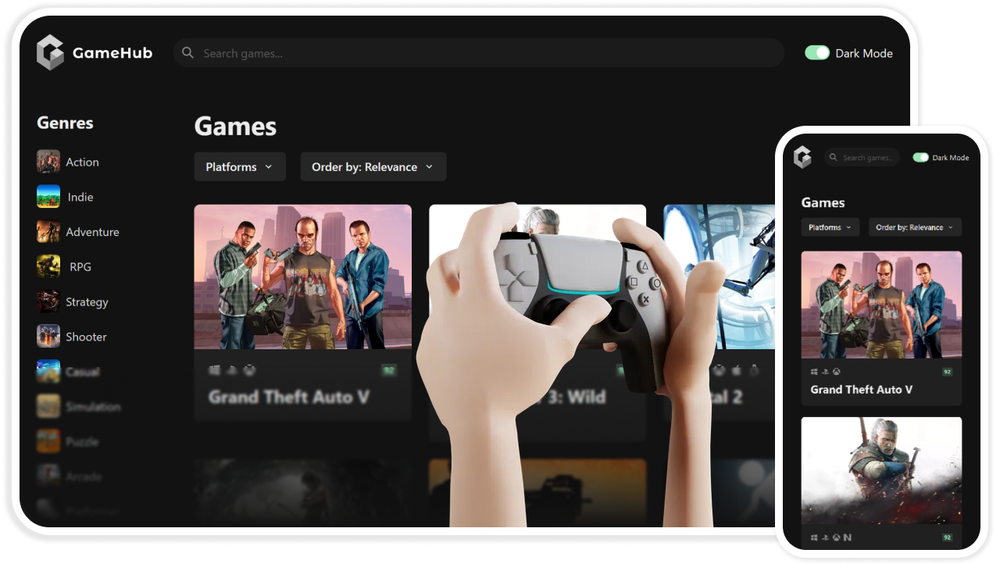

# 

Video Game Discovery Web App (React + TypeScript)

<h3>About</h3>

 GameHub is a video game discovery web application that helps you find new and exciting games to play. Thanks to data fetching and filtering functions, you can search for games by platform, genre and more.

<h3>Technologies</h3>

<code>react</code>
<code>typescript</code>
<code>video-games-api</code>
<code>chakra-ui</code>
<code>custom-data-fetching</code>
<code>filtering-and-searching</code>
<code>dark-mode</code>

